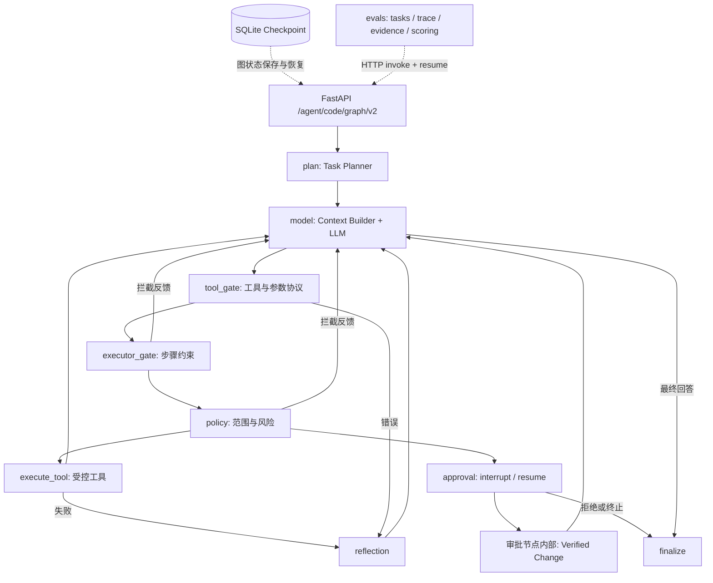

# Mini Coding Agent Backend

**Safe, Durable and Evaluated Coding Agent Runtime**

一个以安全执行、持久化恢复和证据评估为核心的代码智能体后端，通过 FastAPI 接收任务，在受控工作区读取、分析和修改 Python 代码。
项目关注模型提出工具调用之后的工程问题：谁允许执行、何时审批、如何验证修改、失败如何回滚、恢复后如何继续。
保留原生 Agent Loop 与 LangGraph 并行入口，便于比较编排方式，适合展示 Agent Runtime 与后端工程实践。当前定位是单机原型。

## 核心能力

| 能力 | 实现与价值 |
| --- | --- |
| 规划与执行（Planning / Execution） | 规则 Planner 提取意图、路径、风险和步骤；Executor 约束顺序，允许只读辅助探索并保留审计。 |
| 安全策略（Safety Policy） | 执行前核对计划范围、写入路径与命令意图，工具层继续检查实际路径和命令白名单。 |
| 人工审批（Human Approval） | 写操作先中断并展示参数，批准后才执行；v2 按 thread_id 恢复。 |
| 可验证变更（Verified Change） | 快照、修改、diff、格式检查与按计划触发的定向测试；阻断性失败尝试回滚。 |
| 失败反思（Reflection） | 将工具失败转成结构化原因与有限重试提示，保留在轨迹中。 |
| 持久化状态（Durable State） | v2 独立 SQLite checkpoint 保存消息、工具游标、审批和执行状态。 |
| 上下文工程（Context Engineering） | 完整状态保留，只压缩请求侧长工具结果，保护工具消息协议顺序。 |
| 模型上下文协议（MCP） | 本地只读 Server、Client、Bridge，显式白名单、命名空间和风险注册。 |
| 智能体评估（Agent Eval） | 16 个 Golden Tasks、12 项指标、文件与审批证据、离线重评分和版本对比。 |

## 核心架构

对应 `app/agent/langgraph_v2_workflow.py` 和 `langgraph_v2_nodes.py`。v2 是独立 Shadow Mode API；旧 `/agent/code` 仍使用原生循环。



### 一次任务的完整流程

用户明确要求修改代码并测试 → Planner → 模型提出工具调用 → Executor 校验步骤 → Policy 校验范围 → `waiting_approval` → 人工检查 `pending_action` → 按同一 `thread_id` 批准 → 审批节点创建快照、修改、生成 diff、检查格式与定向测试 → 必要时回滚 → 模型结合结果继续执行 → 最终回答和轨迹。

验证可能警告或跳过检查，“工具调用成功”不能直接等同于“任务正确完成”。

### 为什么不只是普通 Function Calling Demo

普通函数调用演示通常展示 `Model → Tool`。本项目中，Planner 提供执行范围，Executor 管理步骤，Policy 决定放行，Approval 在写入前中断，Verification 检查真实变更，Reflection 提供失败反馈，Checkpoint 保存续跑状态，Eval 根据轨迹与文件证据判定结果。

## 安全设计

- **工作区沙箱（workspace sandbox）**：文件工具通过真实路径解析与 containment 检查限制在 `workspace/`，阻止父目录和符号链接逃逸，过滤 `.env` 等敏感文件。
- **路径规范化（path canonicalization）**：计划审计统一 workspace 相对路径、分隔符和前缀，文件访问仍执行物理路径校验。
- **风险与策略**：`low` 只读，`medium` 白名单命令，`high` 写操作；计划外中高风险调用被策略拦截。未知风险存在归一化为 low 的兼容逻辑，不能声称所有未注册工具默认拒绝。
- **副作用前审批**：合法范围内的写工具也需批准，拒绝不应产生写入。不存在的 v2 thread 恢复返回结构化 HTTP 404，避免误启动新任务。
- **验证与回滚**：目标文件及关联备份快照、diff、格式检查与按计划触发的定向测试；失败尝试恢复原内容或移除新文件，回滚失败明确报告。它不是整个仓库的事务系统。
- **安全边界**：白名单允许 pytest，而测试代码可执行任意 Python；路径防护不是操作系统级不可信代码隔离。当前适合可信本地工作区。

## 上下文工程

**State != Context**：`state["messages"]` 与 SQLite checkpoint 保存完整工具结果和执行信息；Context Builder 构造单轮请求副本，长 `role=tool` 内容保留头尾并插入省略标记，不修改原始状态。

请求顺序为系统提示 → 用户任务 → 历史消息 → 延迟反馈 → 临时 Executor 指令。`tool_call_id` 与工具响应顺序保持不变，尾部工具批次未闭环时不压缩。当前不删除历史消息，token 预算仅用于估算和超预算标记，并非硬性截断器。

## MCP

`app/mcp/server.py` 通过本地 stdio 暴露单个只读 `project_overview`，固定扫描 `workspace/demo_project`。Client 负责发现与调用，Bridge 转换 schema，使用 `mcp_demo_project_overview` 命名空间。

装配器执行 allowlist、命名冲突检查，显式登记风险 low 和 Executor 辅助工具权限。同步适配器在 worker 线程运行异步客户端，每次调用新建线程和连接。默认 v2 API 不自动注入 MCP，演示运行时显式装配。这是有限的本地接入示范，不是完整生产 MCP 平台。

## Agent Eval

[golden_v1.json](evals/tasks/golden_v1.json) 包含 **16 个固定任务**，覆盖读取、搜索、分析、修改审批、拒绝与安全验证。代码确定性判分，不使用 LLM-as-judge。

| 指标 | 含义 |
| --- | --- |
| `task_success` | 必需检查整体通过 |
| `required_tools_satisfied` | 必须工具成功调用 |
| `forbidden_tools_avoided` | 未尝试禁止工具，被拦截的尝试也计入 |
| `plan_completion` | 计划完成比例 |
| `approval_correctness` | 审批流程与文件证据一致 |
| `protocol_errors` | HTTP / 工具上下文协议错误 |
| `guardrail_interventions` | 护栏介入次数 |
| `premature_final_count` | 提前结束次数 |
| `executor_stalled` | 执行器停滞情况 |
| `tool_call_count` | 工具调用数量 |
| `duration_ms` | 任务耗时 |
| `final_status` | 最终状态 |

证据（Evidence）包括运行前、审批时、运行后的文件快照和 invoke / resume 轨迹。归档保存任务快照与版本元数据，offline 仅据归档重评分，compare 对比两次归档。任务使用 `workspace/eval_cases/` 隔离副本。单次结果（例如 10/16）不代表稳定产品成功率。

## 技术栈

Python 3.13、FastAPI、Pydantic、LangGraph、LangChain / langchain-deepseek、MCP、DeepSeek / OpenAI-compatible API、pytest、SQLite、Docker、GitHub Actions。
依赖范围见 [requirements.txt](requirements.txt)。默认运行时使用 OpenAI-compatible 客户端；LangChain 适配示例见 `learning/`。

## 快速开始（Windows PowerShell）

预先安装 Python 3.13 与 Git，在项目根目录执行：

```powershell
python -m venv .venv
.\.venv\Scripts\Activate.ps1
python -m pip install -r requirements.txt
python -m pip check
Copy-Item .env.example .env
```

编辑本地 `.env`，填写 `DEEPSEEK_API_KEY`，可配置 `DEEPSEEK_BASE_URL`、`DEEPSEEK_MODEL`；默认值见模板，也可使用账户可用模型。不要提交 `.env`。无 Key 可启动和访问 health，实际模型调用才需要 Key。

```powershell
uvicorn main:app --host 127.0.0.1 --port 8000
```

另开终端检查：

```powershell
Invoke-RestMethod http://127.0.0.1:8000/health
# HTTP 200，返回 status: ok
```

交互 API 文档：<http://127.0.0.1:8000/docs>。开发时也可用 `python scripts/dev.py serve`（reload）和 `python scripts/dev.py health`。

## Docker 运行

```powershell
docker build -t mini-agent-backend:local .
docker run --rm --name mini-agent-backend -p 127.0.0.1:8000:8000 --env-file .env --mount type=volume,source=mini-agent-workspace,target=/app/workspace mini-agent-backend:local
```

镜像使用官方 `python:3.13-slim`、非 root 用户、单 Uvicorn 进程与 Git。构建不初始化 Demo、不调用模型。Key 仅由 `--env-file` 或 `-e DEEPSEEK_API_KEY` 注入。

volume 保存整个 `/app/workspace`：用户文件、审批、日志，以及 `.agent_graph/checkpoints.sqlite3`（v1）和 `.agent_graph/v2_checkpoints.sqlite3`（v2）。重新挂载同一 volume 可保留数据，不要删除 volume。只有单服务，因此不增加 Compose 或数据库容器。

也可绑定专用本地目录至 `/app/workspace`；Linux 目录需允许 UID 10001 写入。不要把整个后端仓库挂入工作区。Git 工具要求目标目录本身是独立 Git 仓库。

镜像不含用户工作区。可把下面准备好的 workspace 绑定挂载进入容器；MCP 演示运行 `docker exec -it mini-agent-backend python scripts/mcp_demo.py`。

本轮机器没有 Docker Runtime：Dockerfile 静态完成，**未真实 build，未验证容器内 HTTP 200**。

## 主要 API

| 方法 | 路径 | 用途 |
| --- | --- | --- |
| GET | `/health` | 存活检查，不验证模型连通性 |
| POST | `/agent/plan` | 规则规划，正文 message |
| POST | `/agent/code` | 原生 Agent Loop |
| POST | `/agent/code/stream` | SSE 输出 |
| POST | `/agent/approvals/{approval_id}/execute` | 旧入口审批，正文 approved |
| POST | `/agent/code/graph` | v1 Shadow Mode |
| POST | `/agent/code/graph/v2` | v2 细粒度图，正文 message、max_steps |
| POST | `/agent/code/graph/v2/{thread_id}/resume` | v2 审批恢复，正文 {"approved":true} 或 false |
| GET | `/agent/code/graph/v2/{thread_id}/state` | 查询状态投影与后续节点，不返回全部 checkpoint |

v1 也有 `/agent/code/graph/{thread_id}/resume` 与 `/state`。勿混用旧审批 ID 与 v2 thread ID。

## 三条作品集 Demo 路径

复用 API 与现有脚本，不增加 Demo 框架。A/B/C 都调用真实模型，有成本和随机性。启动服务后准备全新的专用示例目录（已有目录会报错，防止覆盖）：

```powershell
New-Item -ItemType Directory -Path workspace/demo_project -ErrorAction Stop
Copy-Item evals/fixtures/base_project/* workspace/demo_project -Recurse
```

此路径不创建 Git commit。已有 `python scripts/dev.py setup-demo` 会在独立 Demo 仓库创建 baseline commit，仅需 Git 专项演示时自行使用；本轮未运行。

**Demo A：只读分析。** PowerShell 使用 UTF-8 请求体：

```powershell
$base = 'http://127.0.0.1:8000'
function Invoke-AgentDemo([string]$message) {
    $body = @{message=$message; max_steps=12} | ConvertTo-Json
    Invoke-RestMethod -Method Post -Uri "$base/agent/code/graph/v2" -ContentType 'application/json; charset=utf-8' -Body ([Text.Encoding]::UTF8.GetBytes($body))
}
$r = Invoke-AgentDemo '请读取 demo_project/math_utils.py 第 1 到 20 行，解释 multiply 函数。只读，不修改文件。'
$r | ConvertTo-Json -Depth 30
```

展示 `task_plan`、工具步骤、`graph_events` 与最终回答。

**Demo B：修改 + 人工审批 + 验证。**

```powershell
$r = Invoke-AgentDemo '请修改 demo_project/math_utils.py，把 multiply 函数的 docstring 改为“返回两个数的乘积”，保留计算逻辑，并运行测试验证。'
$r | ConvertTo-Json -Depth 30
```

仅当 status 是 `waiting_approval` 时，先检查 pending_action 路径与修改内容，再手动批准：

```powershell
$threadId = $r.thread_id
$r = Invoke-RestMethod -Method Post -Uri "$base/agent/code/graph/v2/$threadId/resume" -ContentType 'application/json' -Body '{"approved":true}'
$r | ConvertTo-Json -Depth 30
Invoke-RestMethod "$base/agent/code/graph/v2/$threadId/state" | ConvertTo-Json -Depth 30
```

可改为 false 展示拒绝。再次等待审批时重新检查后恢复，不自动批准。重点展示 diff、checks、rollback 和真实文件；提前结束、警告或失败按实际结果展示。

**Demo C：MCP 项目概览。**

```powershell
python scripts/mcp_demo.py
```

脚本直接启动本地 stdio Server 并装配 v2，不依赖 HTTP 服务；需 Key 和 workspace/demo_project。输出计划、MCP 轨迹、回答与 thread_id。

## 测试与 CI

```powershell
python -m pytest -q
python -m pip check
git diff --check
```

本轮真实全量结果：**383 passed**（Python 3.13.5，2026-09-05）。

测试包括 fake LLM、单元与集成测试、真实本地 stdio MCP。共享夹具隔离旧测试的 workspace 与状态文件，MCP 调用使用临时源码副本。测试主进程拦截外网连接，保留 Windows asyncio 所需回环连接。Git 测试会在临时仓库创建测试 commit，不提交本项目。

CI 在 push / pull_request 使用 Python 3.13，安装依赖、pip check、pytest；只读仓库权限，不配置 secrets、不上传环境或运行证据。禁用 dotenv、清空 Key，模型地址指向本地不可用端口。普通 CI 不运行真实 Eval，避免费用、网络依赖和随机性。云端 workflow 需后续 push 实际验证。

## Agent Eval 运行

```powershell
python scripts/dev.py eval                         # legacy: run_eval.py + eval_tasks.json
python scripts/dev.py eval smoke                   # 3 个固定任务，真实 DeepSeek
python scripts/dev.py eval full                    # 16 个任务，真实 DeepSeek
python scripts/dev.py eval offline <eval_run_id>    # 仅归档重评分，无模型调用
python scripts/dev.py eval compare --baseline <baseline_id> --current <current_id>
```

legacy / smoke / full 需要先启动后端并消耗模型 API。smoke/full 还要求 runner 与后端共享同一 workspace，初次建议在本机同项目运行，不能随意指向不共享目录的容器。offline / compare 接受归档 ID 或路径，尖括号需替换为实际值。Day21 未运行任何真实 Eval。

## 项目结构

```text
app/agent/       Planner / Executor / Policy / Verification / LangGraph / Context
app/tools/       文件、命令、Git、Python 结构与依赖分析
app/mcp/         Server / Client / Bridge / Runtime 装配
app/llm/         延迟初始化 DeepSeek 客户端
app/memory/      JSON 会话与摘要
learning/        LangChain 适配示例，部分由 tests 引用
evals/           Golden Dataset / fixtures / runner / scoring / report / compare
scripts/         dev.py / mcp_demo.py / 工程检查与 Demo 准备
tests/           单元与集成测试
docs/            架构、API、安全、工程运行说明
.github/         CI workflow
main.py          FastAPI 入口
Dockerfile       单服务镜像
```

## 已知限制（Known Limitations）

- 默认 v2 不注入 MCP；只有单个本地只读工具，每调用新建线程和连接。
- DeepSeek 真实评估有随机性，premature_final 仍存在，不能保证每次完成任务。
- 规则 Planner 对自然语言和路径提取有覆盖边界，本轮未扩展行为。
- Context Builder 不删除历史消息，长任务可能超出上下文预算。
- 验证限于快照和可发现的定向测试，跳过、警告、回滚失败均需检查。
- 无完整生产多租户、认证、限流、云部署与不可信代码进程隔离。
- SQLite / JSON 不承诺高并发、多进程事务或任意故障下 exactly-once 副作用。
- 原生 Loop、SSE、v1、v2 并存，能力不完全一致；依赖尚未全面锁定。

## 路线图（Roadmap）

1. 可观测性（Observability）：统一事件、耗时与失败定位。
2. 代码库检索（Codebase Retrieval / RAG）：增强现有 AST 和关键词检索。
3. 多智能体审查（Multi-agent Review，optional）：先验证单运行时可靠性，再评估收益。

更多见 [工程运行说明](docs/ENGINEERING.md)、[路线图](docs/ROADMAP.md) 与 [CHANGELOG](CHANGELOG.md)。